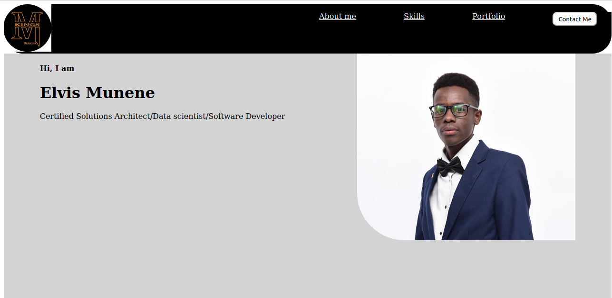

# myPersonalPortfolio
# By Elvis Munene
[java-app](assets/images/page-2.png)
## Table of Content
* Description.
* Features
* Requirements
* Installation Process
* Live link
* Technology used
* Licence
* Authors Info
* # Description
***
This project is a personal web aplication. The web application is designed to showcase my skills to potential clients.
# Features
***
Users for this application will be able to (p)
1. Contact me for services.
2. View my profile.

Requirements.
1. Possetion of a computing device eg phone, computer, tablet or laptop.
2. Internet conectivity.
Installation Process
***
*git clone:git@github.com:Elvis-Munene/myPersonalPortfolio.git
*unzip the file.
*use a broser to open the file.

# Live Link
https://elvis-munene.github.io/myPersonalPortfolio/
